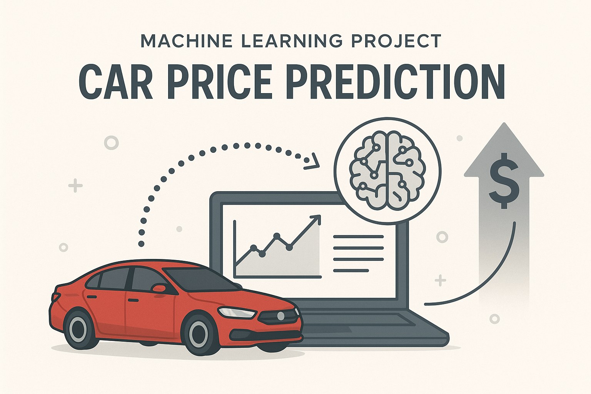
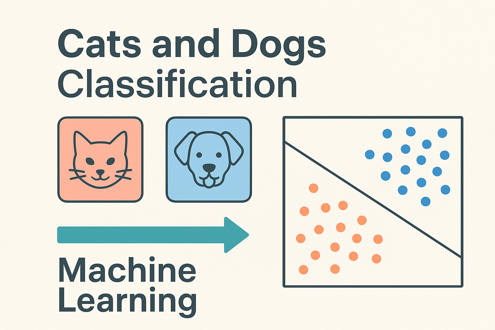

# 👨‍💻 John Doe

**Software Engineer | Full-Stack Developer | Problem Solver**

I’m John — a software engineer passionate about building elegant, efficient, and user-centric applications. With a strong foundation in both frontend and backend development, I specialize in crafting digital solutions that deliver real-world impact.

## 🚗 Car Price Prediction Using Machine Learning

📄 **[Download Project Notebook](resources/car-sales.ipynb)**

### 🔍 Overview

This project leverages machine learning to predict the selling price of used cars based on key features such as brand, model, mileage, year, fuel type, and more. The aim is to help users make smarter buying and selling decisions with accurate price predictions.

---

### 🎯 Objectives

* Collect and preprocess a dataset of used car listings
* Perform exploratory data analysis (EDA) to uncover trends
* Train and evaluate regression models for accurate predictions
* Deploy the model via a web app or API for real-time use

---

### 🧰 Technologies Used

* **Python** – Pandas, NumPy, Scikit-learn, Matplotlib, Seaborn
* **ML Algorithms** – Linear Regression, Random Forest, XGBoost
* **Notebook** – Jupyter for experimentation and visualization
* **Backend** – Flask or FastAPI for deployment
* *(Optional)* **Mobile** – Core ML + SwiftUI for iOS integration

---

### ✨ Key Features

* Interactive visualizations and correlation heatmaps
* Evaluation using MAE, RMSE, and R² metrics
* Clean, modular code for easy reuse and scaling
* *(Optional)* Frontend form for live prediction based on user input

--- 

## 🐱🐶 Cats and Dogs Image Classification Using Machine Learning

📄 **[Download Project Notebook](resources/car-sales.ipynb)**

Overview:
This project focuses on building an image classification model that can accurately distinguish between cats and dogs. Using convolutional neural networks (CNNs), the model learns from a large dataset of labeled pet images and achieves high accuracy in predicting the correct class. 
